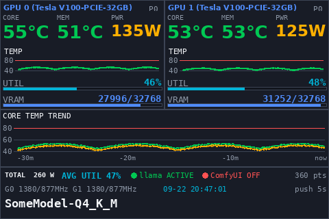

# GPUTemp — Turing Smart Screen GPU ダッシュボード

GPU 2枚（Tesla V100-PCIE-32GB x2）載せの LLM サーバの GPU 状態を、
USB 接続の Turing Smart Screen 3.5"（UsbMonitor）に常時表示するシステム。

```
このリポジトリ（git 正本）
  └── scp ──> <GPU サーバ>:~/gpu_dash/   <- 実行環境（venv + systemd）
```

## 構成

| ファイル | 役割 |
|---|---|
| `gpu_dash.py` | 本体。サンプリング→描画→差分送信 |
| `orient_probe.py` | 向き・キャンバスサイズの検証用プローブ（解決済みの切り分けに使用） |
| `gpu-dash.service` | systemd unit（`User=YOUR_USER`, `Group=dialout`, `Restart=always`。User とパスは自分の環境に合わせて変更） |
| `99-turing-screen.rules` | udev rule。`/dev/ttyACM0` を 0666 に（sudo不要化） |
| `install_root.sh` | root で1回実行する導入スクリプト（udev + systemd 導入・有効化） |
| `assets/preview_latest.png` | 現行レイアウトのプレビュー画像。**合成データ**（`tools/gen_preview.py` で生成、実サーバ情報なし） |
| `tools/gen_preview.py` | プレビュー画像の再生成スクリプト（nvidia-smi / /proc 使わず固定ダミー値のみ） |

## パネルについての実測事実（2026-09-21 確定）

実機は Turing/UsbMonitor 3.5"、HELLO コマンドは無応答。以下は probes で確定したことで、
推測ではない:

- **ネイティブ raster は 480x320（横長）**。320x480 ビットマップを送ると横幅480のバッファに
  流し込まれて行が折り返される（CD が AB に重なる症状）→ キャンバスは `480x320`、向きコマンドなし
- **`SET_ORIENTATION` を送ると以後のビットマップが一切映らなくなる** → 送らない
- **受信したビットマップを 180 度回転して表示する** → 送信前にこちらで 180 度回転（`FLIP180`）
- 物理設置は横長（横幅480）。`--flip180` で正位置を確認済

## 転送設計（なぜ差分送信か）

パネルは RGB565 を 115200 baud（実効 ~11,520 B/s）で受け取る。
全面 480x320 は 307,200 B = **約27秒**の送信時間で、5秒リフレッシュは物理的に不可能。

そこで各ウィジェットを独立した小さなビットマップとして固定位置に描画し、
**MD5 ハッシュが変わった領域だけ**送る。グラフ類は `min_interval` でさらに時間スロットル。

 steady-state の5秒サイクルは数 KB 程度（全面 worst case ではなく）。

領域一覧は `gpu_dash.py --report` で確認できる。

## 現在のレイアウト（480x320）



## 表示内容と判定基準

| 表示 | 出典 |
|---|---|
| CORE / MEM 温度 | `nvidia-smi` の `temperature.gpu` / `temperature.memory`（MEM は HBM2 の温度） |
| PWR | `power.draw`（5W 丸め。桁数の揺れを防ぐため領域幅は `255W` 基準で事前確保） |
| UTIL / VRAM | `utilization.gpu` / `memory.used` |
| G0/G1 クロック | `clocks.sm` / `clocks.mem` |
| P0 等 | `pstate` |
| 日付 | そのフレームを採取した瞬間のサーバ時刻（`stamp`、8秒スロットル） |
| `N pts` | トレンド窓のサンプル数 = 保持30分 ÷ 5秒ごとのサンプル = 360 |
| llama ACTIVE | **プロセス検索が主基準**（`/proc/*/cmdline` に `llama-server`）。systemd unit 参照は複数サービスの使い分けで正しくならないため主基準から撤廃し、プロセスが見つからない場合のみ照会する fallback に格下げ（unit 名は `llama_unit` で設定） |
| モデル名 | 同上の cmdline から `--model` パスを抽出し `<repo名(-GGUF除去)>-<量子化ディレクトリ>` に変換（例: `SomeModel-GGUF/Q4_K_M/xxx.gguf` → `SomeModel-Q4_K_M`） |
| ComfyUI ACTIVE | `/proc/*/cmdline` に `ComfyUI/main.py` |

色分け:

| 項目 | 緑 | 黄 | 赤 |
|---|---|---|---|
| CORE / MEM 温度 | <58℃ | <70℃ | ≥70℃ |
| PWR | ≤80W | ≤150W | >150W |
| グラフの閾値線 | — | — | 80℃（gpu-watchdog が llama を止める基準と一致） |

単位は ℃（U+2103、DejaVu にグリフあり）。

## 導入手順（サーバ側）

```bash
# 1) 正本を配る（YOUR_USER@YOUR_GPU_SERVER は自分の環境に合わせる）
scp gpu_dash.py orient_probe.py 99-turing-screen.rules gpu-dash.service install_root.sh \
    YOUR_USER@YOUR_GPU_SERVER:~/gpu_dash/

# 2) venv（初回のみ）
ssh YOUR_USER@YOUR_GPU_SERVER
cd ~/gpu_dash && python3 -m venv venv && ./venv/bin/pip install pillow pyserial

# 2b) gpu-dash.service の User= とパスを実際のアカウントに書き換える

# 3) 画面表示の確認（sudo 不要、udev 適用後）
./venv/bin/python gpu_dash.py --once

# 4) root で1回だけ導入（udev 0666 + systemd 有効化）
sudo bash ~/gpu_dash/install_root.sh

# 5) 常駐の停止 / 起動
sudo systemctl stop gpu-dash
sudo systemctl start gpu-dash
```

## 検証用オプション

```bash
./venv/bin/python gpu_dash.py --dry-run --once      # out/preview.png 生成（画面を使わない）
./venv/bin/python gpu_dash.py --report               # 領域別送信コスト表
./venv/bin/python gpu_dash.py --dry-run --once --fake-load 2.5   # 3桁PWR・色の検証
./venv/bin/python gpu_dash.py --demo 400 --dry-run --once        # 履歴ありのレイアウト確認
```

## 設定ノブ（`gpu_dash.py` 冒頭の config）

```python
DESIGN_W, DESIGN_H = 480, 320      # 実測で確定したキャンバス
FLIP180 = True                     # パネルの180度回転を補償
INTERVAL = 5.0                     # サンプル周期
HISTORY_MINUTES = 30               # トレンド窓（360 pts）
TEMP_SCALE_MIN, TEMP_SCALE_MAX = 40, 90
TEMP_WARN, TEMP_CRIT = 58, 70      # 温度フォント色
TEMP_LIMIT = 80                    # グラフの赤線
POWER_WARN, POWER_CRIT = 80, 150   # PWRフォント色
SPARK_MIN_INTERVAL, TREND_MIN_INTERVAL = 20.0, 45.0
```

依存: pillow, pyserial（サーバ venv）。フォントはサーバの DejaVu。

## ライセンスと参考元

- このリポジトリは **GPL-3.0-or-later**（`LICENSE` 参照、各スクリプトに SPDX 識別子）。
- シリアルプロトコル（6バイトフレームヘッダ、コマンド値、RGB565 エンコード、HELLO/_brightness_ の挙動）は
  [mathoudebine/turing-smart-screen-python](https://github.com/mathoudebine/turing-smart-screen-python)
  （GPL-3.0-or-later, Copyright (C) 2021 Matthieu Houdebine 他）の `library/lcd/lcd_comm_rev_a.py` を
  検証基準として使用している。本リポジトリの実装は独立に記述したものだが、プロトコル形式の帰属として明記する。
- Turing / UsbMonitor / XuanFang は各社の登録商標であり、本プロジェクトはそれらと無関係。
- **公式ソフト（USBMonitor.exe / ExtendScreen.exe 等）は本リポジトリに含めない。**
  実パネルの挙動（180度回転、SET_ORIENTATION 無効化）は公式ソフトの動作を観察して得た知識に基づくのみで、
  取得・同梱はしていない。
- 依存: pillow（LGPL-adjacent / HP-style license）、pyserial（BSD-3-Clause）— pip 経由で導入、同梱しない。
- フォント: DejaVu（サーバのシステムフォント、Bitstream Vera ライセンス）— 同梱しない。
